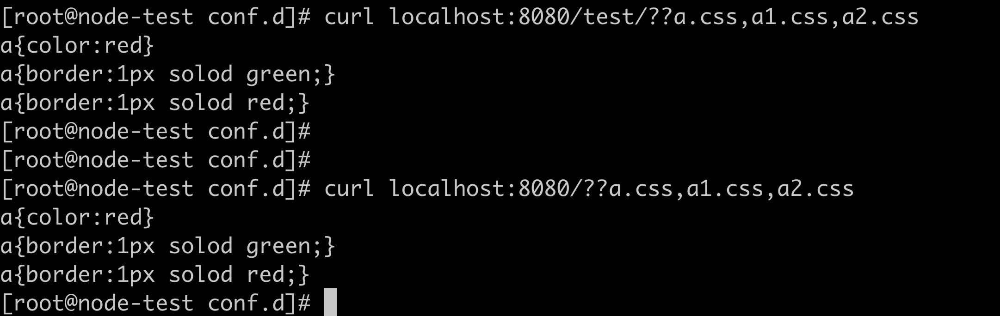

# Convert this module into Dynamic MODULE

## Description
> Concat module is used to compress static file, like js, css and etc.It default built as static module, and it supports dynamic module after version of 1.9.11.
>reference link: https://www.nginx.com/resources/wiki/extending/converting/
## Build steps
> Since my customer needs run concat in N+ r18, the oss version is 1.15.10, I build and verify this dynamic module under 1.15.10 and N+ R18.
### convert config file
```config
ngx_addon_name=ngx_http_concat_module                # module name
HTTP_MODULES="$HTTP_MODULES ngx_http_concat_module"  # add modules
NGX_ADDON_SRCS="$NGX_ADDON_SRCS $ngx_addon_dir/ngx_http_concat_module.c" # specify source code path
```
### build under oss version
Configure and make as following command.
```shell
./configure  --with-compat --add-dynamic-module=../nginx-http-concat --with-openssl=../openssl-1.1.1c  --with-pcre=../pcre-8.41  --with-zlib=../zlib-1.2.11
```
```shell
make
```
Then, go to objs folder to check the .so file.

## verify
### add load_module directive in nginx.conf
> load_module modules/ngx_http_concat_module.so;
### add concat config
```config
server {

    listen       8080;


    #charset koi8-r;

    #access_log  /var/log/nginx/host.access.log  main;


    location / {

        root   /etc/nginx/html/;

        index  index.html index.htm;

        concat on;

        concat_max_files 20;

        concat_unique off;

        concat_types text/css application/javascript;

    }
}
```
### test the function

